# Re:member

A journey through fading memories. Re:member is a pixel-art themed journaling application where entries visually degrade over time, simulating the natural decay of memories. The app features a retro, glitchy aesthetic reminiscent of old CRT monitors, creating a unique and nostalgic journaling experience.

## Key Features

- **Memory Decay**: Journal entries visually degrade over time with sophisticated text corruption algorithms
- **Cloud Synchronization**: Access your memories across devices with Firebase-powered cloud storage
- **User Authentication**: Secure your memories with email or Google sign-in
- **Memory Restoration**: Restore degraded memories through interactive challenges
- **Achievement System**: Track your journaling journey with unlockable achievements
- **Visual Effects**: Immersive retro experience with CRT screen effects, RGB splitting, and glitch animations
- **Offline Mode**: Create and edit memories even without internet connection
- **Media Attachments**: Add photos to preserve your visual memories

## Screenshots

<strong>Home Screen</strong>

 
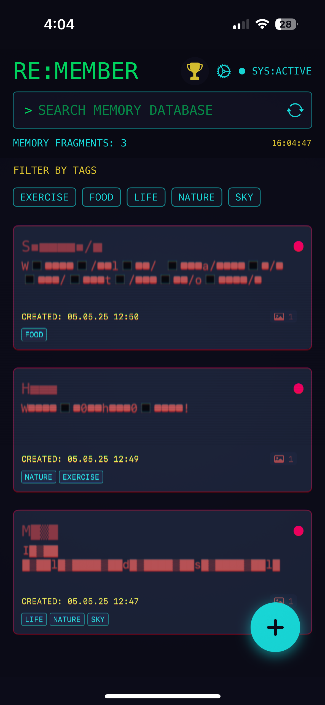

<strong>New Memory</strong>

 
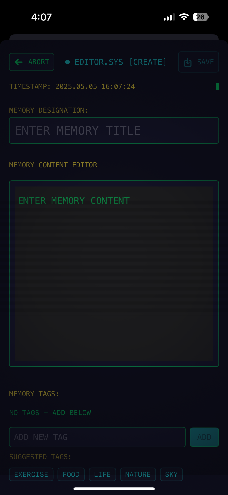
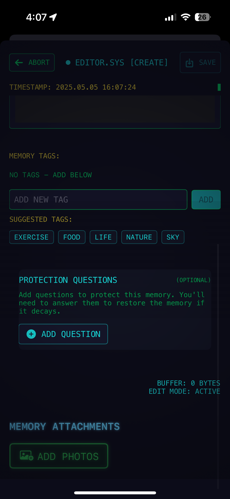

<strong>Memory States</strong>

 
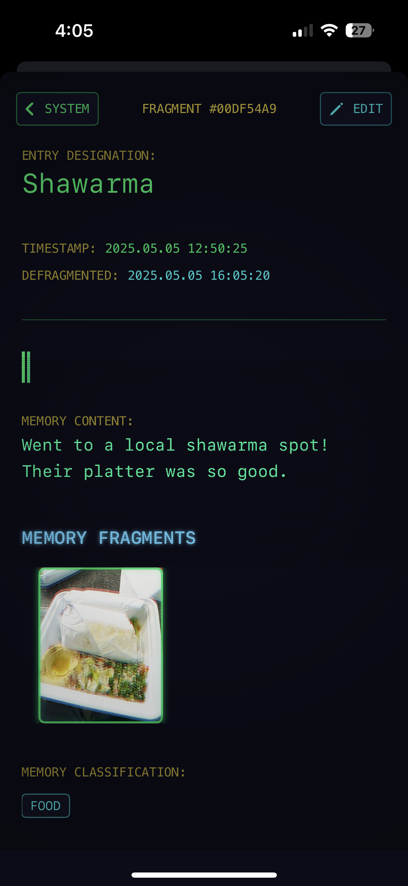
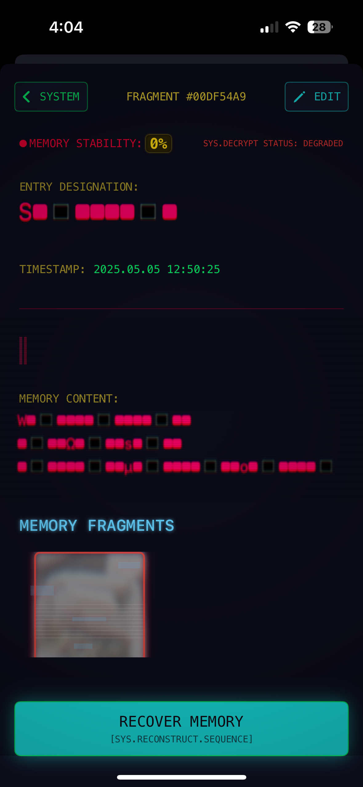

<strong>Memory Recovery</strong>

 
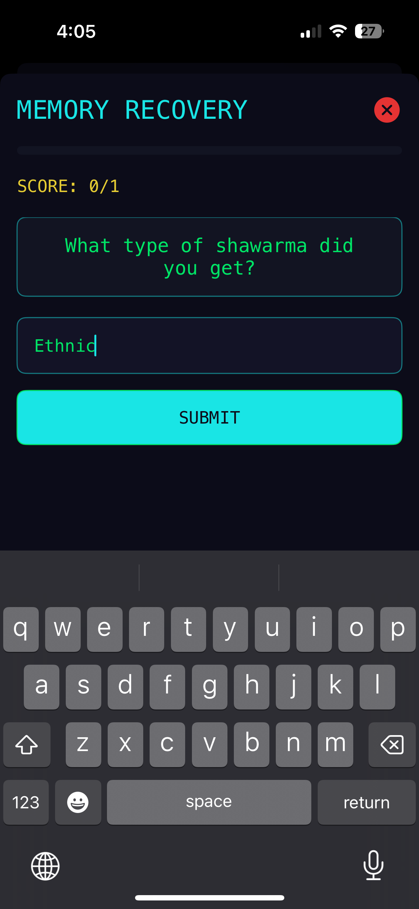
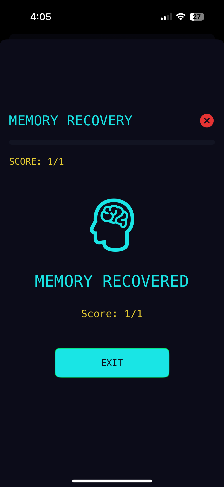
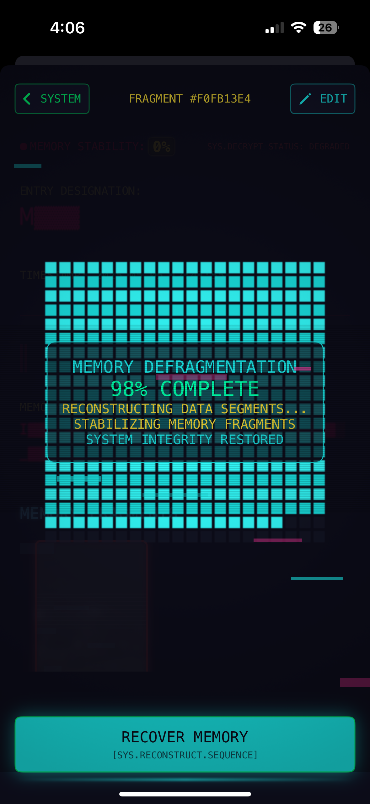

<strong>Other Features</strong>

 
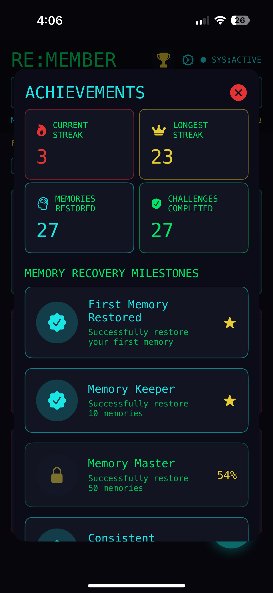
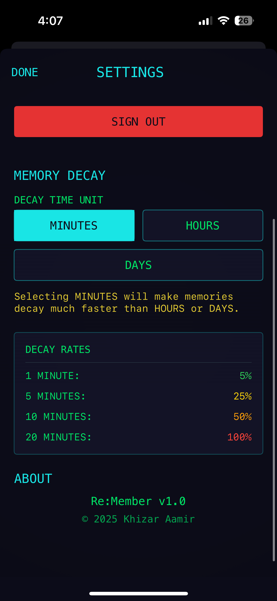
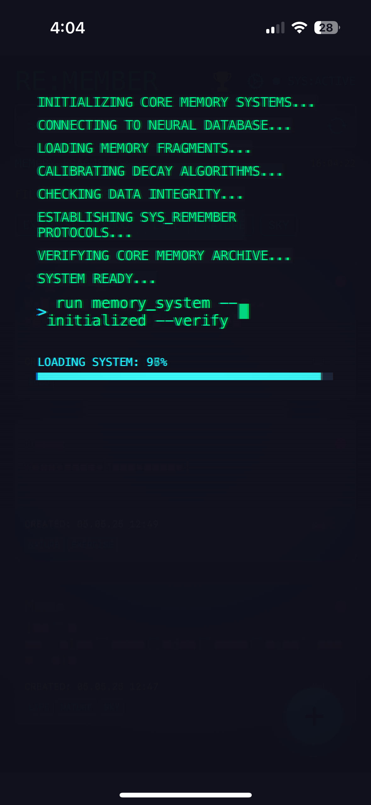

## Technical Details

- **Language & Framework**: Swift and SwiftUI for a modern iOS experience
- **Architecture**: MVVM pattern with clean separation of concerns
- **Data Persistence**: Core Data for local storage with Firebase Firestore for cloud sync
- **Authentication**: Firebase Authentication with email and Google Sign-In
- **Visual Effects**: Custom SwiftUI modifiers and text decay algorithms
- **Caching**: Smart caching system for decay effects to improve performance

## Requirements

- iOS 15.0+
- Xcode 14.0+
- Swift 5.6+

## Installation

1. Clone this repository
2. Open ReMember.xcodeproj in Xcode
3. Add your Firebase configuration file (GoogleService-Info.plist)
4. Build and run the project on your device or simulator

## Personal Note

Re:member started as a personal project to explore the ephemeral nature of memories. As someone fascinated by how our brains selectively preserve and distort memories over time, I wanted to create an app that visually represents this decay while giving users the ability to actively preserve what matters most to them.

The glitchy, retro aesthetic is not just a style choice - it's a metaphor for how our memories can become corrupted, fragmented, and eventually lost without regular reinforcement. By turning memory preservation into an engaging activity, Re:member aims to encourage more mindful journaling and reflection.

I hope you find this project both useful and thought-provoking. Your memories deserve to be remembered.

## License

[MIT License](LICENSE)

## Credits

Created with ❤️ by Khizar Aamir 